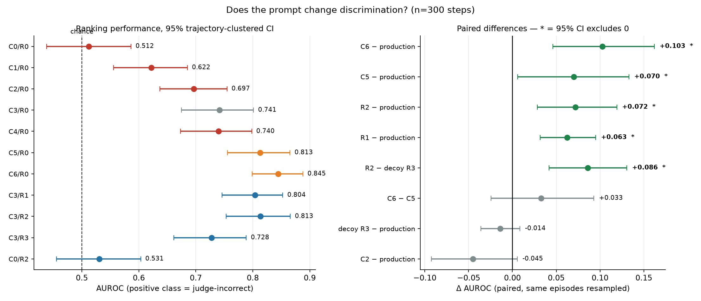
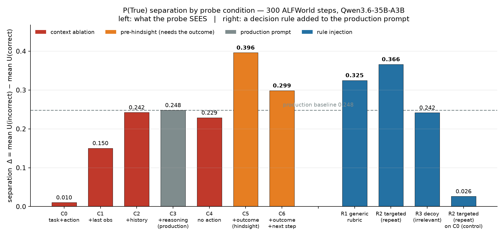
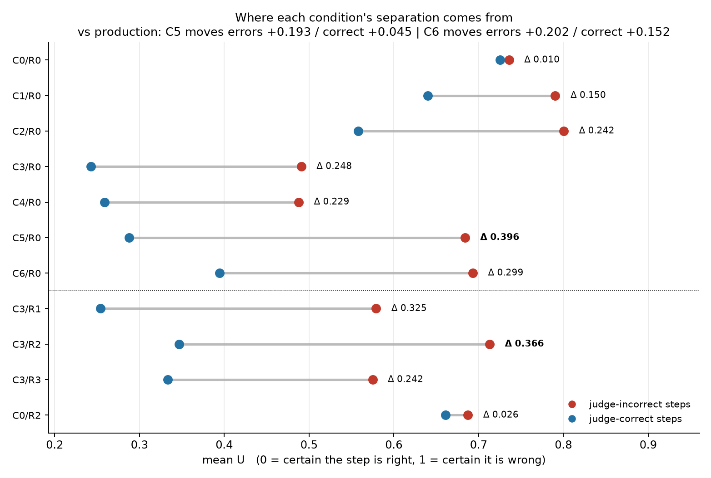
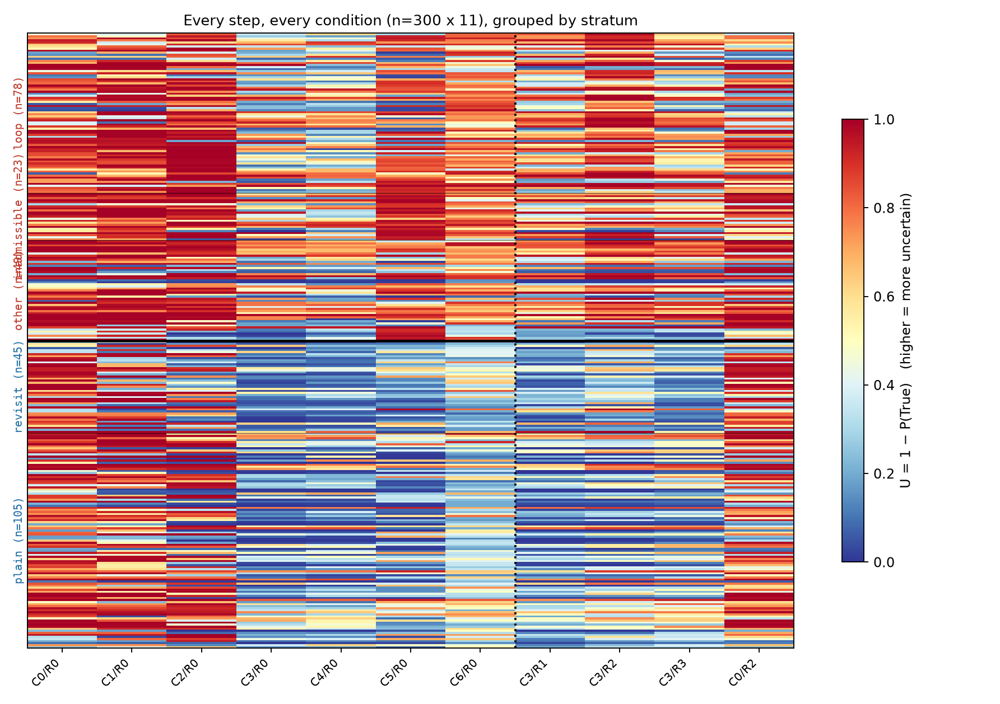
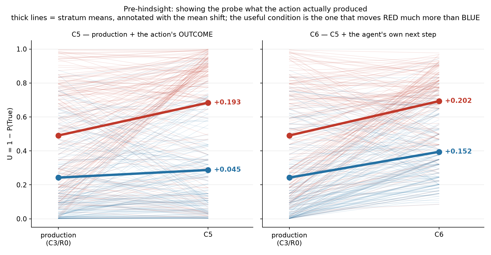
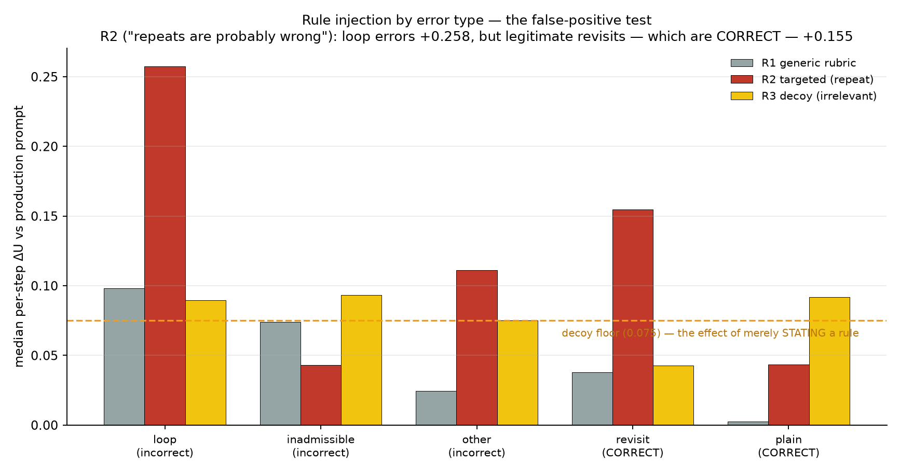

# Does the P(True) prompt matter? — context ablation and rule injection

**n = 300 steps × 11 conditions = 3300 probe calls, 3300/3300 parsed.** Qwen3.6-35B-A3B,
frozen ALFWorld entangled corpus (`result/e1/e1b/`), 3-judge step labels.

**Question.** Our step-level uncertainty signal is P(True): show the model a frozen agent step and
read the renormalized Yes/No mass on the first generated token. The probe prompt was written once
and never interrogated. Two things could be wrong with it — it may show the model the wrong
*context*, and it may omit *decision rules* the model would use if told. This tests both.

> **This report supersedes an n=20 pilot. Three of its findings did not survive the scale-up**;
> §6 lists them explicitly. The pilot's artifacts are kept at `figures/ctxrule_n20/` and
> `result/ctxrule/ptrue_ctxrule_e1b.{jsonl,md}` so the reversals are auditable.

## Headline

1. **Pre-hindsight is the largest effect.** Showing the probe the observation the action actually
   produced: AUROC 0.741 → **0.813**, paired ΔAUROC **+0.070 [+0.006, +0.133]**. Adding the
   agent's own next step on top (C6) reaches **0.845**, ΔAUROC **+0.103 [+0.046, +0.162]**.
2. **A relevant rule genuinely helps; merely stating a rule does not.** The targeted repeat-rule
   beats the production prompt (+0.072 [+0.029, +0.119]) *and* beats the irrelevant decoy rule
   (**+0.086 [+0.042, +0.131]**), while the decoy alone does nothing for ranking
   (−0.014 [−0.036, +0.008]) despite shifting uncertainty upward on 247/300 steps. Stating a rule
   makes the model more pessimistic; only a *relevant* rule makes it more discriminating.
3. **But the rule still manufactures false positives.** It raises uncertainty on legitimate
   revisits — which are **correct** — by +0.155 (42/45 up). Real gain, real cost.
4. **The action string is nearly worthless on its own, and redundant given reasoning.**
   Task + action alone is at chance (0.512 [0.438, 0.586]). Removing the action from the
   production prompt costs nothing (C4 0.740 vs C3 0.741).

---

## 1. Design

The agent is never re-run; each condition is one extra single-token probe call over logged text.

### Sample — 300 steps

150 unanimous-incorrect + 150 unanimous-correct (non-unanimous steps excluded, so both poles are
clean), fixed seed, drawn from a pool of 2576 labeled steps, ≤3 steps per trajectory. Incorrect
steps are stratified **by error type** because the rule factor needs something to bite on; correct
steps deliberately include legitimate revisits, the false-positive test for a repeat-rule.

| | stratum | n | what it is |
|---|---|---|---|
| incorrect | `loop` | 78 | judges cite repetition ("Re-taking tomato 1 is a repeated action") |
| incorrect | `other` | 49 | wrong inference, out-of-order step |
| incorrect | `inadmissible` | 23 | invalid / wrong-object action |
| correct | `plain` | 105 | ordinary good step |
| correct | `revisit` | 45 | **legitimately** repeats a location ("Going back to the toilet is required to deposit the second tissuebox") |

Correct steps are chosen to **match the incorrect step-index distribution** (nearest-neighbour),
so the context ladder is not simply reading history *length*. Median step_idx 20.0 vs 12.5; the
residual gap is structural — late steps in these episodes are mostly errors.

### What the history actually contains

Verified against the logged prompts, not assumed: **all 300 histories are action/observation
turns only** — bare `> action` lines followed by the environment's response, zero `THOUGHT:` or
`CONFIDENCE:` markers (`REACT_HISTORY_MODE=action_obs`; the `full` retention mode is shelved).

This matters for reading the ladder: C3 does **not** add the agent's reasoning *history*. It adds
exactly one thought — the reasoning for the step under evaluation.

### Conditions — 11 cells, deliberately not a 5×4 cross

**Factor A — context ablation (what the probe sees), no rule:**

| | contents |
|---|---|
| C0 | task + action |
| C1 | task + last observation + action |
| C2 | task + full history + action |
| **C3** | task + full history + reasoning + action — **the production prompt** |
| C4 | task + full history + reasoning, no action |
| C5 | C3 + the observation the action actually produced — **pre-hindsight** |
| C6 | C5 + the agent's own next reasoning and action — **pre-hindsight, full** |

**Factor B — a rule added to the production prompt** as `EVALUATION GUIDANCE:` before the question:

| | rule |
|---|---|
| R1 | generic rubric (repeats / absent object / inadmissible) |
| R2 | targeted: "If the action repeats something the agent has already tried in the history, it is probably wrong." |
| R3 | **decoy** — plausible, falsifiable, irrelevant: "If the action targets an object mentioned late in the task description rather than early, it is probably wrong." |

**Plus one control, C0/R2**: the same repeat-rule in a prompt containing *no history* — nothing
there to detect a repeat in. Movement there is compliance, not detection.

### Three choices that make the result readable

- **C3/R0 is byte-identical to the production probe** (asserted by a selftest against
  `probes.prompt_ptrue_action`), so the baseline is not an accidental fourth prompt change.
- **The Yes/No question is byte-identical across C0–C6.** Pre-hindsight blocks are labeled
  distinctly (`RESULT OF THE PROPOSED ACTION:`) from `PROPOSED ACTION:`, so no wording change is
  stacked on the context factor.
- **Pre-hindsight costs nothing to collect.** Step *t+1*'s logged history *is* step *t*'s history
  plus action *t* and its resulting observation. All 300 steps have a successor, so C5/C6 are
  fully paired.

### Protocol

Every step in all 11 conditions → fully paired. `temperature=0, top_p=1.0, top_k=20`, penalties
off; U from the first non-whitespace token's top-20 Yes/No mass; **3300/3300 parsed**, nothing
imputed. Metrics: **Δ = mean U(incorrect) − mean U(correct)**; **AUROC** (positive class =
incorrect), which unlike Δ is immune to the scale shifts between contexts; 95% CIs from a
**trajectory-clustered bootstrap** (episodes resampled with their steps).

---

## 2. Results

### 2.1 Discrimination by condition



| condition | what changed | mean U inc | mean U cor | Δ | **AUROC [95% CI]** |
|---|---|---|---|---|---|
| C0/R0 | task + action | 0.736 | 0.725 | 0.010 | 0.512 [0.438, 0.586] |
| C1/R0 | + last observation | 0.790 | 0.640 | 0.150 | 0.622 [0.555, 0.685] |
| C2/R0 | + full history | 0.800 | 0.558 | 0.242 | 0.697 [0.637, 0.755] |
| **C3/R0** | **+ reasoning (production)** | **0.491** | **0.243** | **0.248** | **0.741 [0.675, 0.801]** |
| C4/R0 | history + reasoning, no action | 0.488 | 0.259 | 0.229 | 0.740 [0.673, 0.798] |
| C5/R0 | + outcome (pre-hindsight) | 0.684 | 0.288 | **0.396** | **0.813 [0.756, 0.865]** |
| C6/R0 | + outcome + next step | 0.693 | 0.394 | 0.299 | **0.845 [0.799, 0.888]** |
| C3/R1 | generic rubric | 0.579 | 0.254 | 0.325 | 0.804 [0.746, 0.853] |
| C3/R2 | targeted repeat-rule | 0.713 | 0.347 | 0.366 | 0.813 [0.753, 0.866] |
| C3/R3 | **decoy** rule | 0.575 | 0.333 | 0.242 | 0.728 [0.661, 0.789] |
| C0/R2 | repeat-rule, no history (control) | 0.687 | 0.661 | 0.026 | 0.531 [0.455, 0.603] |

Paired ΔAUROC vs the production prompt (same episodes resampled in both arms):

| comparison | ΔAUROC [95% CI] | |
|---|---|---|
| C6 − production | +0.103 [+0.046, +0.162] | **significant** |
| R2 − **decoy R3** | +0.086 [+0.042, +0.131] | **significant** |
| R2 − production | +0.072 [+0.029, +0.119] | **significant** |
| C5 − production | +0.070 [+0.006, +0.133] | **significant** |
| R1 − production | +0.063 [+0.032, +0.095] | **significant** |
| C6 − C5 | +0.033 [−0.025, +0.093] | n.s. |
| decoy R3 − production | −0.014 [−0.036, +0.008] | n.s. |
| C2 − production | −0.045 [−0.092, +0.005] | n.s. |

**Δ and AUROC disagree for C6, and AUROC is the one to trust.** C6 has a *smaller* Δ than C5
(0.299 vs 0.396) but a *higher* AUROC (0.845 vs 0.813): it compresses the scale — correct steps
move up too — while still ordering steps better. Δ rewards a stretched scale; AUROC only rewards
correct ordering. Any Δ comparison across conditions is partly a comparison of scales.

### 2.2 Separation, and where it comes from





A Δ grows either because the probe becomes more suspicious of **errors** (useful) or of
**everything** (costly in false positives). C5 moves errors +0.193 and correct only +0.045. C6
moves errors +0.202 but correct +0.152. R2 moves errors +0.222 and correct +0.104.

Note the absolute levels: C0–C2 sit at U ≈ 0.74–0.80 on errors while C3–C4 sit near 0.49. Adding
one thought moves the whole scale, not just the ordering. **A threshold tuned in one context is
meaningless in another.**

### 2.3 The context ladder



- **C0 = 0.512, indistinguishable from chance.** The action string alone carries no signal. (23 of
  3300 prompts are byte-identical duplicates, all C0: two steps in one episode that took the same
  action produce the same C0 prompt. The ablation is working — C0 genuinely cannot tell them apart.)
- **History is what buys discrimination**: 0.512 → 0.622 (last observation) → 0.697 (full history).
- **One thought adds a little more**: 0.697 → 0.741, though C2 − production is −0.045 [−0.092,
  +0.005], i.e. not individually significant.
- **The action is redundant once you have history + reasoning**: C4 (no action) 0.740 vs C3 0.741.
  The probe is effectively scoring the reasoning, not the action string.

### 2.4 Pre-hindsight



Both pre-hindsight conditions beat the production prompt significantly. **C6 − C5 is +0.033
[−0.025, +0.093] — not significant**, so on this evidence the environment's response is what
matters and the agent's continuation adds nothing reliable. C5 is also the cleaner instrument: it
lifts errors while barely touching correct steps, whereas C6 raises both.

C5/C6 are a deployable probe only where actions are **reversible** (act → observe → assess →
undo). Where they are not, read them as a ceiling on what P(True) could know.

### 2.5 Rule injection



**Test 1 — detection or compliance? Passes.** The same rule with no history to apply it to moves
nothing: C0/R2 − C0/R0 = −0.024 overall, −0.027 on loop steps (26/78 up, i.e. below half). In the
production context it moves +0.130 overall and +0.258 on loop steps (77/78 up).

**Test 2 — does it beat the decoy floor? Passes, and this is the key control.** Merely stating a
rule raises U on 247/300 steps (median +0.075) but yields ΔAUROC −0.014 [−0.036, +0.008] — a pure
level shift, no ranking gain. The targeted rule beats the decoy by +0.086 [+0.042, +0.131].

**Test 3 — is it specific to the error it names? Mixed.** Median ΔU vs production, by stratum:

| stratum | label | R2 | R1 | R3 (decoy) |
|---|---|---|---|---|
| `loop` | incorrect | **+0.258** (77/78 up) | +0.098 | +0.089 |
| `other` | incorrect | +0.111 | +0.025 | +0.075 |
| `inadmissible` | incorrect | +0.043 | +0.074 | +0.093 |
| `revisit` | **CORRECT** | **+0.155** (42/45 up) | +0.038 | +0.042 |
| `plain` | CORRECT | +0.044 | +0.002 | +0.092 |

The rule fires hardest on exactly the errors it names (`loop`, +0.258) — genuine rule application.
But it also fires on **legitimate revisits, which are correct** (+0.155, 42/45 up). It has learned
"repetition looks bad", not "unproductive repetition looks bad". That is the cost side of its
+0.072 AUROC gain, and it falls on precisely the steps a deployed filter must not flag.

---

## 3. What this means for the probe

- **The current prompt is not broken.** It is well above chance (0.741) and no context ablation
  beats it. The written-once prompt was a reasonable choice.
- **The one free improvement is the outcome**, where the setting allows it. +0.070 AUROC for one
  extra token per step and no re-run.
- **Rules work but are not free.** Report any rule-augmented probe against a decoy floor and with
  its false-positive rate on the steps the rule superficially resembles, or the gain will read as
  prompt-tuning that trades precision for recall silently.
- **Never compare U across contexts without re-thresholding**, and prefer AUROC to Δ when
  comparing conditions at all.

---

## 4. Threats to validity

- **One arm, one model.** Qwen entangled ALFWorld only. The server's `probes.py` still has the
  unfixed `_HIST_RE`, so a decoupled replication needs that patch pushed first, or its context
  rungs will silently collapse to empty history.
- **Residual step-position imbalance** (median 20.0 vs 12.5 after matching). The C0→C2 climb is
  partly history length; C3 vs C2 and all the rule/hindsight comparisons are paired within-step
  and unaffected.
- **`inadmissible` has n=23**, much weaker than the other strata. Its reversal from the pilot
  (+0.531 → +0.043) shows how unstable that cell was at n=3.
- **Judge labels are 3 LLM judges**, and the strata come from keyword-tagging their free-text
  reasons (hand-checked, not formally verified).
- **Pre-hindsight needs reversibility.** In ALFWorld most actions are reversible; in a
  tool-calling or irreversible-side-effect setting C5/C6 are a ceiling, not a probe.
- **AUROC CIs overlap** between several conditions; the paired ΔAUROC column, not the marginal
  CIs, is what establishes the significant differences.

---

## 5. What follows

1. **Adopt C5 where actions are reversible**; run it over the full labeled corpus, both arms.
2. **Treat C6 as unproven** — it has the highest AUROC but C6 − C5 is not significant, and it
   costs scale compression.
3. **If a rule is used, keep the decoy arm permanently** as the floor, and always report the
   revisit false-positive rate beside the gain.
4. **Replicate on decoupled** (after pushing the `_HIST_RE` fix) and on a second model family —
   the Llama P(True) affirmation bias could interact strongly with rule injection.

---

## 6. What changed from the n=20 pilot

Three pilot findings reversed. Recorded because the reversals are the point: at n=20 the CIs
spanned ±0.25 and the smallest strata had n=3.

| pilot claim (n=20) | n=300 | verdict |
|---|---|---|
| "The agent's reasoning **masks** its errors — C2 (0.207) beats production (0.155)" | C2 0.697 vs production 0.741; ΔAUROC −0.045 [−0.092, +0.005] | **Reversed.** Production is at least as good. |
| "Rule injection is mostly **suggestibility** — the decoy reproduces most of it" | R2 − decoy = +0.086 [+0.042, +0.131] | **Reversed.** The decoy shifts level but not ranking; the relevant rule adds real discrimination. |
| "R2 fires hardest on `inadmissible` (+0.531) and `revisit` (+0.491), not on `loop` (+0.237)" | loop +0.258 > revisit +0.155 > inadmissible +0.043 | **Reversed.** The rule *is* loop-specific; the false-positive cost is real but secondary. |
| "C6 is worse than C5" | C6 AUROC 0.845 > C5 0.813, but C6 − C5 n.s. | **Partly.** True on Δ, not on ranking; the honest read is "no reliable difference". |
| "C5 is the clean win" | ΔAUROC +0.070 [+0.006, +0.133] | **Held.** |
| "C0/R2 rules out pure compliance" | −0.024, 26/78 up on loop steps | **Held.** |

---

## 7. Artifacts and reproduction

| | |
|---|---|
| probe / analysis code | `src/ptrue_context_rule_probe.py` (select / dump / run / report / selftest) |
| figures | `analysis/ctxrule_figures.py` → `figures/ctxrule/*.png` (n=300), `figures/ctxrule_n20/` (pilot) |
| sweep records (3300) | `result/ctxrule/ptrue_ctxrule_e1b_n300.jsonl` |
| step × condition matrix | `result/ctxrule/ptrue_ctxrule_e1b_n300_matrix.csv` |
| auto-generated tables + per-step detail with judge votes | `result/ctxrule/ptrue_ctxrule_e1b_n300.md` |
| selection (reviewable/editable) | `result/ctxrule/sel_e1b_n300.json` |
| queued runner | `run_ctxrule_n300.sh` (waits for any free GPU, serves, sweeps, frees the GPU) |

```bash
# 1. select (no GPU) — step-index matched, successor required for C5/C6
python src/ptrue_context_rule_probe.py select \
  --uq result/e1/e1b/uq_entangled_e1.jsonl --judge result/e1/e1b/judge_entangled_e1.jsonl \
  --out result/ctxrule/sel_e1b_n300.json --n-incorrect 150 --n-correct 150 \
  --n-loop 60 --n-inadmissible 45 --n-revisit 45 --max-per-task 3 --match-step-idx
# 2. inspect the 11 real prompts for a step before spending GPU
python src/ptrue_context_rule_probe.py dump --selection result/ctxrule/sel_e1b_n300.json --step 0
# 3. sweep (any served model: --model/--tokenizer/--base-url, or PROBE_* env)
python src/ptrue_context_rule_probe.py run --selection result/ctxrule/sel_e1b_n300.json \
  --out result/ctxrule/ptrue_ctxrule_e1b_n300.jsonl --model qwen --tokenizer <snapshot> \
  --concurrency 11
# 4. report + figures (no GPU)
python src/ptrue_context_rule_probe.py report \
  --records result/ctxrule/ptrue_ctxrule_e1b_n300.jsonl \
  --csv result/ctxrule/ptrue_ctxrule_e1b_n300_matrix.csv \
  --out result/ctxrule/ptrue_ctxrule_e1b_n300.md
python analysis/ctxrule_figures.py --records result/ctxrule/ptrue_ctxrule_e1b_n300.jsonl \
  --outdir result/ctxrule/figures_n300
```

Run: 2026-07-31, Qwen3.6-35B-A3B on one A100 (vLLM 0.23.0, util 0.90, `--max-num-seqs 128`,
prefix caching off). 3300 single-token calls in ~5 min wall-clock at `--concurrency 11`
(2305 s of summed per-call latency, ~9300 prefill tokens/s, median 710 prompt tokens per call).
Job `64061a27`, sweep exit 0, GPU released automatically.
